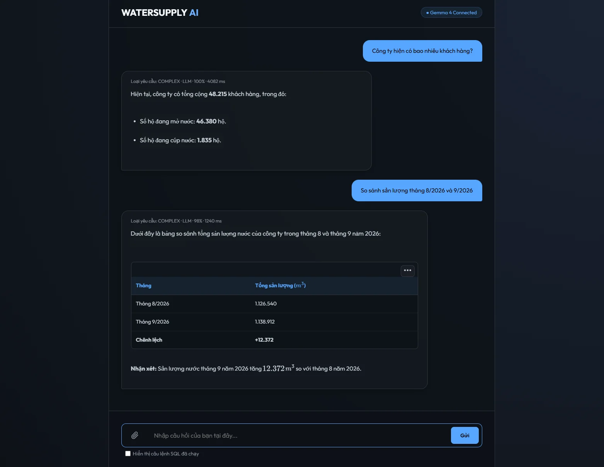
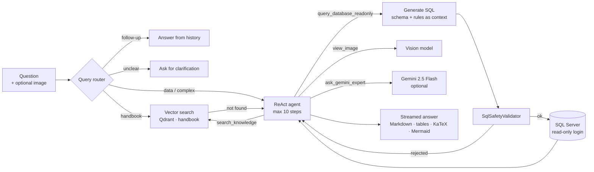

# RAG WaterSupply — Vietnamese AI assistant for water-utility data

An internal AI assistant that lets staff of a water utility ask questions in Vietnamese and get answers from
two sources: a **service handbook** (RAG over Qdrant) and the **operational SQL Server database**
(text-to-SQL by a ReAct agent, guarded by a multi-layer SQL validator).

> This is a **public demo** of a tool I built for a water utility. Company name, schema, business rules,
> handbook and data are all **synthetic** — nothing here comes from the real system.
> The UI, prompts and code comments are in Vietnamese.



## How it works



- **Router** (`QueryRouter`) classifies each turn: answer from conversation history, ask a clarifying question,
  small talk, handbook lookup, or hand over to the agent.
- **Handbook RAG**: the handbook is chunked, embedded with `nomic-embed-text` (Ollama) and searched in Qdrant,
  filtered by document type. If the answer is not in the handbook, the pipeline falls back to the agent.
- **ReAct agent** (`AgentOrchestrator`): at every step the model returns JSON choosing one tool from an allowlist.
  Unknown tools and invalid JSON are rejected and fed back to the agent as an observation.
- **Text-to-SQL** (`SqlGenerationService`): the full schema and business rules (also stored in Qdrant) are given as
  context; previous failed attempts are included so the model can correct itself.
- **Streaming**: everything is pushed to the browser with Server-Sent Events (status, route, SQL, answer deltas).

## SQL safety — three layers

LLM-generated SQL is treated as untrusted input.

1. **Text checks** — exactly one statement, no comments, must start with `SELECT`/`WITH`, blocks write/dangerous
   keywords (`INSERT`, `EXEC`, `INTO`, `OPENROWSET`, `WAITFOR`, …) and system metadata (`sys.`, `INFORMATION_SCHEMA`).
   String literals are stripped first, so data like `N'a; b -- c'` is not a false positive.
2. **Real T-SQL parsing** with Microsoft's `TransactSql.ScriptDom`: the whole syntax tree is visited and **every**
   data source — including comma joins, sub-queries and `APPLY` — must be a table from the schema (or a CTE),
   in schema `dbo`, with no cross-database/server names. Table-valued functions are rejected.
3. **Least privilege in the database** — the app connects as `rag_reader`, which only has `SELECT` on the
   schema tables (`database/seed.sql`). Results are capped at 200 rows with a 30 s timeout.

Layer 2 exists because a regex-only check can be bypassed with an old-style comma join
(`SELECT * FROM KHACH_HANG, OtherTable`). This case is covered by the tests.

## Tech stack

C# · .NET 10 (minimal API) · Ollama (Gemma 4, nomic-embed-text) · Qdrant · SQL Server · ScriptDom ·
Gemini API (optional) · vanilla JS UI with marked, KaTeX, Mermaid, DOMPurify, ExcelJS · xUnit.

## Run it locally

Prerequisites: .NET 10 SDK, Docker, [Ollama](https://ollama.com) and `sqlcmd`.

```bash
# 1. Infrastructure: Qdrant + SQL Server
cp .env.example .env            # then change both passwords
docker compose up -d

# 2. Demo database + read-only login
sqlcmd -S localhost,1433 -U sa -P "<MSSQL_SA_PASSWORD>" -C -i database/seed.sql -v RAG_READER_PASSWORD="<RAG_READER_PASSWORD>"

# 3. Models
ollama pull nomic-embed-text
ollama pull gemma4:31b-cloud    # or any local model, see "Configuration"

# 4. App (set the rag_reader password without putting it in appsettings.json)
cd src/RAG_WaterSupply
dotnet user-secrets init
dotnet user-secrets set "ConnectionStrings:WaterSupply" "Server=localhost,1433;Database=WaterSupplyDemo;User Id=rag_reader;Password=<RAG_READER_PASSWORD>;TrustServerCertificate=True;"
dotnet run

# 5. Load the knowledge base into Qdrant (once)
curl -X POST http://localhost:56723/api/ingest
```

Then open http://localhost:56723 and try:

- *Công ty hiện có bao nhiêu khách hàng đang sử dụng nước?*
- *So sánh sản lượng tháng 8/2026 và 9/2026*
- *Top 5 khách hàng còn nợ nhiều nhất*
- *Thủ tục lắp đặt đồng hồ nước mới như thế nào?* (handbook)
- *Có sự cố nào đang chờ xử lý không?*

Tick **"Hiển thị câu lệnh SQL đã chạy"** in the UI to see the generated SQL.

## Configuration

`src/RAG_WaterSupply/appsettings.json` (override with user-secrets or environment variables such as
`Ollama__Model`, `Gemini__ApiKey`):

| Key | Default | Notes |
| --- | --- | --- |
| `ConnectionStrings:WaterSupply` | `rag_reader` @ localhost | Use the read-only login |
| `Ollama:Url` | `http://localhost:11434` | |
| `Ollama:Model` | `gemma4:31b-cloud` | `-cloud` models run on Ollama's cloud. **Pick a local model if query results must not leave your machine.** |
| `Ollama:EmbeddingModel` | `nomic-embed-text` | 768-dim vectors |
| `Qdrant:Host` / `Qdrant:Port` | `localhost` / `6334` | gRPC port |
| `Gemini:ApiKey` | *(empty)* | Empty disables the `ask_gemini_expert` tool. Sent in the `x-goog-api-key` header. |

## Project structure

```
src/RAG_WaterSupply/
  Program.cs                    endpoints (/api/ask-v2 SSE, /api/ingest, /api/health) and pipelines
  Services/
    QueryRouter.cs              classify each turn
    AgentOrchestrator.cs        ReAct loop (JSON actions, tool allowlist, max 10 steps)
    AgentToolRegistry.cs        tools: knowledge search, read-only SQL, image, Gemini
    SqlGenerationService.cs     text-to-SQL with schema + rules + previous attempts
    SqlSafetyValidator.cs       text checks + ScriptDom syntax-tree validation
    KnowledgeIngestionService.cs / KnowledgeSearchService.cs   Qdrant
  Knowledge/                    demo schema, business rules, service handbook
  wwwroot/                      chat UI
tests/RAG_WaterSupply.Tests/    xUnit tests for the SQL validator
database/seed.sql               demo database, synthetic data, read-only login
docker-compose.yml              Qdrant + SQL Server
```

## Tests

```bash
dotnet test
```

27 cases for `SqlSafetyValidator`: allowed read-only queries, write statements, multiple statements, comments,
`SELECT … INTO`, `WAITFOR`, `OPENROWSET`, system metadata, unknown tables/schemas, cross-database names,
comma-join and sub-query bypass attempts, table-valued functions.
